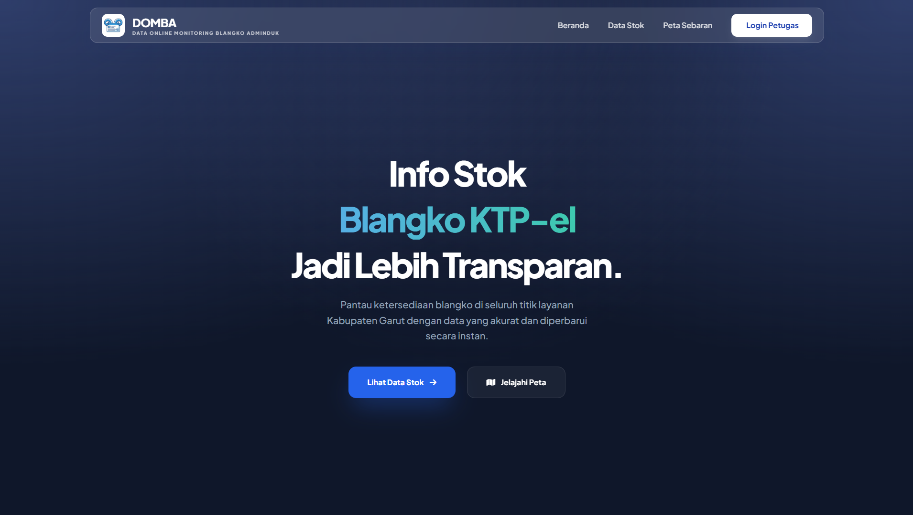

# Sistem Informasi Transparansi Ketersediaan Blangko KTP-el



## Deskripsi Sistem

Sistem informasi transparansi ketersediaan blangko KTP-el untuk seluruh wilayah Kecamatan di Kabupaten Garut. Sistem ini menyediakan dashboard publik yang menampilkan data stok blangko KTP-el secara real-time, interaktif, dan responsif untuk memantau ketersediaan di 42 kecamatan di Kabupaten Garut.

## Fitur Utama

- **Dashboard Publik**: Tampilan data stok blangko KTP-el dengan tabel yang dapat diurutkan dan dicari.
- **Dashboard Admin**: Statistik lengkap stok seluruh kecamatan, monitoring real-time dengan search/filter/sort, alert sistem untuk stok kritis.
- **Dashboard Operator**: Personal dashboard untuk tracking stok kecamatan mereka dan monitoring pencetakan.
- **Peta Interaktif Canggih**: Visualisasi geografis dengan fitur interaktif:
  - **Leaflet.js Map** dengan 42 marker kecamatan di Kabupaten Garut
  - **Live Stock Visualization**: Marker berwarna berdasarkan status stok (Hijau=Tersedia, Kuning=Terbatas, Merah=Habis)
  - **Hover Tooltip**: Tooltip muncul saat hover marker, menampilkan nama kecamatan dan jumlah stok
  - **Touch Support**: Full touch event support untuk mobile/tablet (touchstart, touchend)
  - **Interactive Popup Card**: Klik marker membuka card profesional dengan:
    - Nama kecamatan & visual status indicator
    - Stok realtime dengan icon informasi
    - Last update timestamp
    - Dual coordinate system (marker position tetap dari centroid GeoJSON, navigation link dari precise office coordinates)
    - Action buttons: "Rute" (Google Maps Directions) & "Peta" (Search di Google Maps)
  - **Marker Highlight**: Smooth animation saat hover/touch (radius expand, fill opacity increase)
  - **Dual-Layer Coordinate Architecture**:
    - Marker position: Centroid dari GeoJSON MultiPolygon (stable, administrative boundary center)
    - Google Maps links: Precise office coordinates dari kantor_kecamatan_overrides.json (42 kecamatan + Disdukcapil)
  - **Search & Filter Buttons**: Filter marker berdasarkan status (Tersedia/Terbatas/Habis) di bawah map
  - **Responsive Design**: Optimal display di desktop, tablet, dan mobile
  - **MapProvider**: CartoDB Light tiles untuk clarity dan performance
- **Keamanan Berlapis**: Implementasi CSRF Protection, Content Security Policy (CSP), dan Rate Limiting.
- **Anti-Bot Captcha**: Sistem tantangan matematika sederhana pada halaman login.
- **Halaman Error Kustom**: UI ramah pengguna untuk error 404, 429 (Rate Limit), dan 500.
- **Responsif & Modern**: Desain optimal untuk mobile/tablet menggunakan Tailwind CSS dan Plus Jakarta Sans.
- **Local Assets**: Berjalan sepenuhnya tanpa koneksi internet (semua library CSS/JS sudah lokal).

## Teknologi yang Digunakan

- **Backend**: Flask (Python), SQLAlchemy, PostgreSQL.
- **Keamanan**: Flask-Talisman (CSP/Headers), Flask-WTF (CSRF), Flask-Limiter.
- **Frontend**: Tailwind CSS 3.4, FontAwesome 6 (Local), Plus Jakarta Sans.
- **Peta**: Leaflet.js (Local).
- **Tabel**: DataTables (Local).
- **Autentikasi**: Flask-Login dengan Math Captcha.
- **Notifikasi**: SweetAlert2 (Local).

### Dependencies Python

Project ini menggunakan library Python berikut (lihat `requirements.txt` untuk versi lengkap):

- Flask 2.3+
- Flask-SQLAlchemy 3.0+
- Flask-Login 0.6+
- Flask-WTF 1.1+
- Flask-Migrate 4.0+
- Flask-Talisman 1.0+
- Flask-Limiter 3.3+
- python-dotenv 1.0+
- psycopg2-binary 2.9+
- WTForms 3.0+
- Email-validator 2.0+

Untuk list lengkap, lihat file `requirements.txt` di root project.

## Spesifikasi Server

### Development (Local)
- **OS**: Windows, Linux, macOS
- **Python**: 3.8 - 3.11
- **Database**: PostgreSQL 10+
- **RAM**: Minimal 2 GB
- **Storage**: Minimal 1 GB
- **Network**: Local/LAN (no public internet required)

### Production (VPS/Server)
- **OS**: Ubuntu 20.04 LTS / Debian 11 / CentOS 8+
- **Python**: 3.8 - 3.11
- **Database**: PostgreSQL 12+ (recommended 14+)
- **Web Server**: Nginx
- **App Server**: Gunicorn
- **RAM**: Minimal 4 GB (recommended 8 GB)
- **Storage**: Minimal 20 GB (SSD recommended)
- **CPU**: 2 cores minimum (4 cores recommended)
- **Network**: Public internet dengan SSL/TLS (HTTPS)
- **Domain**: Custom domain dengan DNS setup

Untuk setup production lengkap, lihat: [PRODUCTION.md](PRODUCTION.md)

## Instalasi dan Setup

### Persyaratan Sistem

- Python 3.8+
- PostgreSQL database
- Virtual environment (disarankan)

### Langkah Instalasi

1. **Clone atau download project ini**

2. **Buat virtual environment:**
   ```bash
   python -m venv venv
   ```

3. **Aktivasi virtual environment:**
   - Windows: `venv\Scripts\activate`
   - Linux/Mac: `source venv/bin/activate`

4. **Install dependencies:**
   ```bash
   pip install -r requirements.txt
   ```

5. **Setup database:**
   - Pastikan PostgreSQL berjalan
   - Update konfigurasi database di `config.py`
   - Jalankan migrasi database:
     ```bash
     flask db upgrade
     ```

6. **Inisialisasi data awal:**
   ```bash
   flask init-db
   ```
   Ini akan membuat user admin dengan username: `admin`, password: `admin`

## Menjalankan Aplikasi

```bash
python app.py
```

Aplikasi akan berjalan di `http://127.0.0.1:8000` dan dapat diakses dari jaringan lokal.

## Panduan Produksi (Deployment)

Untuk mendeploy aplikasi ini ke server produksi (VPS), silakan merujuk pada panduan detail di [PRODUCTION.md](PRODUCTION.md). Secara garis besar, tahapan yang diperlukan adalah:

1. **Setup Server**: Persiapan Python, PostgreSQL, dan Nginx pada Ubuntu/Debian atau CentOS.
2. **Database**: Inisialisasi database dan user PostgreSQL.
3. **App Setup**: Konfigurasi virtual environment, install dependencies, dan environment variables.
4. **Service**: Menggunakan Gunicorn dan Systemd untuk agar aplikasi berjalan di background.
5. **Web Server**: Konfigurasi Nginx sebagai Reverse Proxy dan SSL (Certbot) untuk keamanan HTTPS.

## Dokumentasi Lengkap

Untuk dokumentasi lebih detail:

- **[DEVELOPMENT.md](DEVELOPMENT.md)** - Panduan developer lengkap (aktivasi environment, Git workflow, manajemen .env, solusi jaringan VPN)
- **[PRODUCTION.md](PRODUCTION.md)** - Panduan deployment ke VPS lengkap (setup server, database, Nginx, SSL)
- **[BACKUP_SYSTEM.md](BACKUP_SYSTEM.md)** - Sistem backup & restore database (quick start, technical docs, disaster recovery)

### Akses Sistem

- **Dashboard Publik**: `http://127.0.0.1:8000/`
- **Login**: `http://127.0.0.1:8000/auth/login`
- **Dashboard Admin**: `http://127.0.0.1:8000/admin/dashboard` (setelah login sebagai admin)
  - Fitur: Statistik stok, monitoring kecamatan, low stock alerts, search/filter/sort dengan pagination
- **Dashboard Operator**: `http://127.0.0.1:8000/operator/dashboard` (setelah login sebagai operator)
  - Fitur: Personal stock view, monitoring pencetakan, activity timeline

## Struktur Project

```
├── app.py                 # Entry point aplikasi Flask
├── config.py              # Konfigurasi aplikasi
├── requirements.txt       # Dependencies Python
├── setup_project.py       # Script setup project
├── app/
│   ├── __init__.py        # Factory aplikasi Flask
│   ├── extensions.py      # Ekstensi Flask (SQLAlchemy, Login, dll)
│   ├── models.py          # Model database
│   ├── utils.py           # Utility functions
│   ├── routes/            # Blueprint routes
│   │   ├── __init__.py
│   │   ├── admin_routes.py
│   │   ├── auth_routes.py
│   │   ├── ops_routes.py
│   │   └── public_routes.py
│   ├── static/            # Static files (CSS, JS, images)
│   │   ├── css/
│   │   ├── js/
│   │   └── img/
│   └── templates/         # Jinja2 templates
│       ├── base_internal.html
│       ├── base_public.html
│       ├── admin/       │   ├── dashboard.html          # Admin dashboard (statistik & monitoring stok)
       │   ├── monitoring_cetak.html   # Admin monitoring pencetakan
       │   ├── master_user.html
       │   ├── stok_masuk.html
       │   ├── distribusi.html
       │   └── backup.html│       ├── auth/
│       ├── errors/
│       ├── operator/
│       └── public/
└── migrations/            # Database migrations
```

## Penggunaan

### Untuk Pengguna Umum
- Akses dashboard publik untuk melihat ketersediaan blangko KTP-el
- Gunakan fitur pencarian dan pengurutan tabel
- Lihat lokasi kecamatan di peta interaktif

### Untuk Admin/Operator
- Login dengan kredensial yang diberikan
- Kelola data stok dan transaksi
- Monitor aktivitas sistem

## Peta Interaktif - Fitur Detail

Halaman landing page `/` menampilkan peta interaktif yang untuk visualisasi real-time ketersediaan blangko KTP-el.

### Komponen Peta

#### 1. **Marker Visualization**
- **42 Marker Kecamatan** ditempatkan berdasarkan centroid dari GeoJSON administrative boundaries
- **Color Coding berdasarkan Status Stok**:
  - 🟢 Hijau (#10b981): Stok Tersedia (> 20 unit)
  - 🟡 Kuning (#f59e0b): Stok Terbatas (1-20 unit)
  - 🔴 Merah (#f43f5e): Stok Habis (0 unit)
- **Marker Size**: 12px radius normal, expand ke 16px saat hover/touch
- **Smooth Animations**: Brightness filter dan opacity transitions

#### 2. **Interactive Hover & Touch**
- **Desktop - Hover Event**: 
  - Tooltip muncul otomatis dengan nama kecamatan dan stok
  - Marker highlight dan expand
  - Tooltip close saat mouseout
- **Mobile/Tablet - Touch Event**:
  - touchstart: Tooltip muncul + marker highlight
  - Tap untuk buka popup card (tidak perlu double-tap)
  - touchend: Auto-close tooltip jika popup tidak terbuka

#### 3. **Popup Card**
Klik marker membuka card profesional dengan layout berikut:

```
┌─────────────────────────────────────┐
│ Nama Kecamatan          [Header]    │
├─────────────────────────────────────┤
│ 📦 Stok      │ 1234                 │ [Info Grid]
│ ✓ Status     │ Tersedia             │
│ 🕐 Update    │ 14/04/2026 12:18     │
├─────────────────────────────────────┤
│ [Rute]       │ [Peta]               │ [Action Buttons]
└─────────────────────────────────────┘
```

**Card Features:**
- Fixed width (340px) untuk konsistensi
- Responsive buttons: 2 column layout
- "Rute" button: Google Maps Directions
- "Peta" button: Google Maps Search

#### 4. **Dual Coordinate System Architecture**

**Marker Position** (untuk peta display):
- Source: Centroid dari GeoJSON MultiPolygon features
- Data File: `app/static/data/garut_kecamatan.geojson`
- Keuntungan: Stabil, mengikuti geographic center, tidak berubah
- Precision: Low-precision (centroid of administrative boundary)

**Google Maps Links** (untuk navigasi):
- Source: Precise office coordinates dari override file
- Data File: `app/static/data/kantor_kecamatan_overrides.json`
- Contains: 42 kecamatan + Disdukcapil (Jl. Patriot, Tarogong Kidul)
- Keuntungan: Akurat untuk navigation, real office location
- Precision: High-precision (actual office GPS coordinates)

**Example:**
```json
{
  "Garut Kota": [-7.2142134, 107.9021882],  // precise office
  "Tarogong Kidul": [-7.219759, 107.898244], // precise office
  "Dinas": [-7.2018145, 107.8852168]        // Disdukcapil actual location
}
```

#### 5. **Filter Buttons (Bawah Map)**
- `Tersedia`: Show only markers dengan stok > 20
- `Terbatas`: Show only markers dengan stok 1-20  
- `Habis`: Show only markers dengan stok = 0
- Multi-select: Klik beberapa filter untuk kombinasi
- Visual Feedback: Active filter punya ring border dan background tint

#### 6. **Responsive & Performance**
- **Map Container**: Full-width, responsive height
- **Tile Provider**: CartoDB Light (clear, professional, fast)
- **No Scrollable Zoom**: Map tidak require scroll untuk zoom (prevent accidental zoom)
- **Local Libraries**: Leaflet.js & Turf.js sudah lokal
- **Asset Size**: GeoJSON ~450KB (compressed), Leaflet CSS/JS ~250KB total

### Data Sources

| File | Purpose | Records | Type |
|------|---------|---------|------|
| `garut_kecamatan.geojson` | GeoJSON boundaries | 42 kecamatan | MultiPolygon |
| `kantor_kecamatan_overrides.json` | Precise coordinates | 42 kec + Dinas | Lat/Lng pairs |
| Database `stock` table | Real-time stok | Dynamic | Live data |

### Code Structure

**Main JavaScript File**: `app/static/js/public/index.js`
- Line 80+: Leaflet map initialization
- Line 155+: Load GeoJSON dan calculate centroid
- Line 195+: Load precise coordinates dari override JSON
- Line 240+: Place markers dengan dual coordinate system
- Line 290+: Bind tooltip dan popup dengan content
- Line 370+: Handle hover/touch events
- Line 400+: Filter logic untuk buttons

**CSS Styling**: `app/static/css/public/map-interactive.css`
- Popup styling: rounded corners, shadows, border
- Tooltip styling: backdrop-filter blur, semi-transparent
- Marker animations: smooth transitions, brightness filter
- Close button: hidden (auto-close on outside click)

## Catatan Perubahan Terbaru (v1.2)

### Peta Interaktif Canggih (NEW)
✨ **Interactive Map pada Landing Page** dengan fitur:
- Dual-coordinate system (centroid untuk marker, precise untuk navigation)
- Live stock visualization dengan color-coded markers
- Hover tooltip & interactive popup card
- Touch support penuh untuk mobile/tablet
- Filter buttons untuk Tersedia/Terbatas/Habis
- Google Maps integration (Directions & Search)
- Dual-button action bar dengan Rute & Peta
- Responsive design & professional UI/UX

**Files Changed:**
- ✨ Baru: `app/static/css/public/map-interactive.css` (70 lines styling)
- ✨ Baru: `app/static/data/kantor_kecamatan_overrides.json` (44 coordinates)
- 📝 Update: `app/static/js/public/index.js` (major refactor - ~420 lines)
- 📝 Update: `app/templates/public/index.html` (CSS deduplication)

## Catatan Perubahan Terbaru (v1.1)

### Dashboard Admin (FIX)
✅ Dashboard admin sekarang memiliki template terpisah (`admin/dashboard.html`) dari operator  
✅ Admin dapat melihat statistik lengkap: Total Kecamatan, Stok KTP-el, Stok KIA, Total Pengguna  
✅ Fitur monitoring stok dengan tabel interaktif (search, filter, sort, pagination)  
✅ Alert system untuk kecamatan dengan stok < 100 unit  
✅ Recent transactions dan printing activity tracking  
✅ Dashboard operator tetap berfungsi normal (tidak ada perubahan)  

**Perubahan File:**
- ✨ Baru: `app/templates/admin/dashboard.html`
- ✨ Baru: `app/templates/admin/monitoring_cetak.html`
- 📝 Update: `app/routes/admin_routes.py` (routing dan context variables)

## Troubleshooting

### Masalah Umum

1. **Database connection error**
   - Pastikan PostgreSQL berjalan
   - Periksa konfigurasi di `config.py`

2. **Template syntax error**
   - Jalankan validasi template: `python -c "import jinja2; env = jinja2.Environment(); env.parse(open('app/templates/auth/login.html').read()); print('Template syntax is valid')"`

3. **Port sudah digunakan**
   - Ubah port di `app.py` atau hentikan proses yang menggunakan port 8000

4. **Dependencies tidak terinstall**
   - Jalankan `pip install -r requirements.txt` di virtual environment yang aktif

### Logs dan Debugging

- Aplikasi berjalan dalam mode debug
- Periksa console browser untuk error JavaScript
- Periksa terminal untuk error Python/Flask

## Kontribusi

Untuk pengembangan lebih lanjut atau perbaikan, silakan buat issue atau pull request di repository ini.

## Lisensi

Sistem ini dikembangkan oleh Rizki Ade Maulana untuk Dinas Kependudukan dan Pencatatan Sipil Kabupaten Garut.
